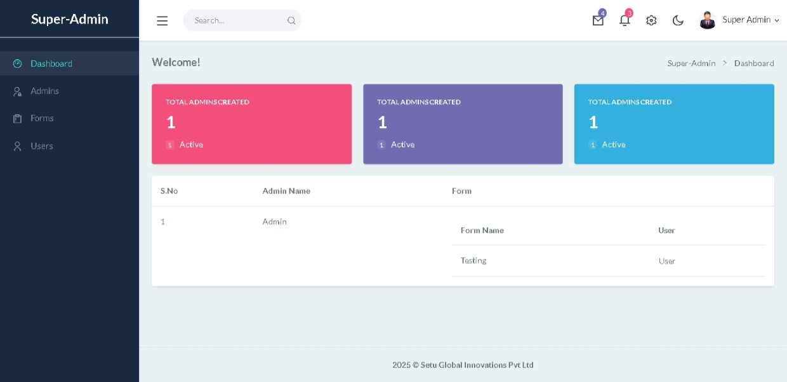
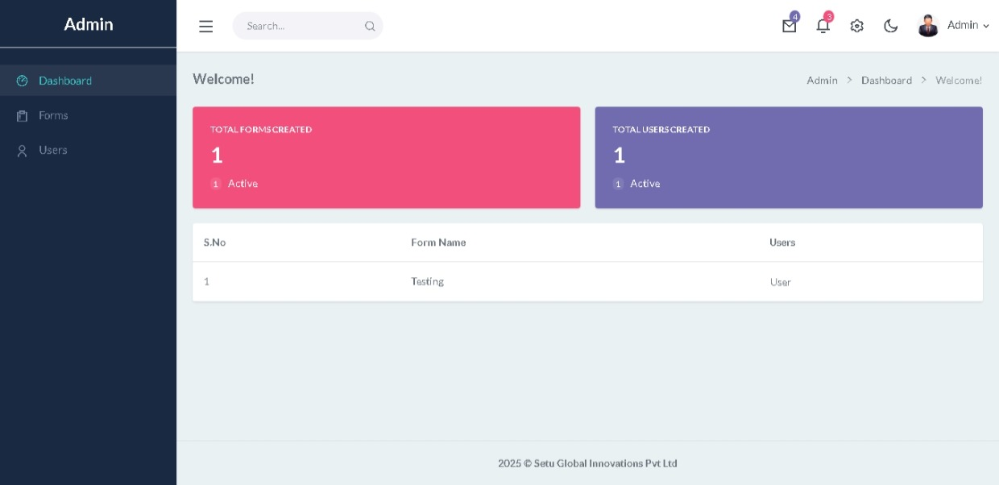
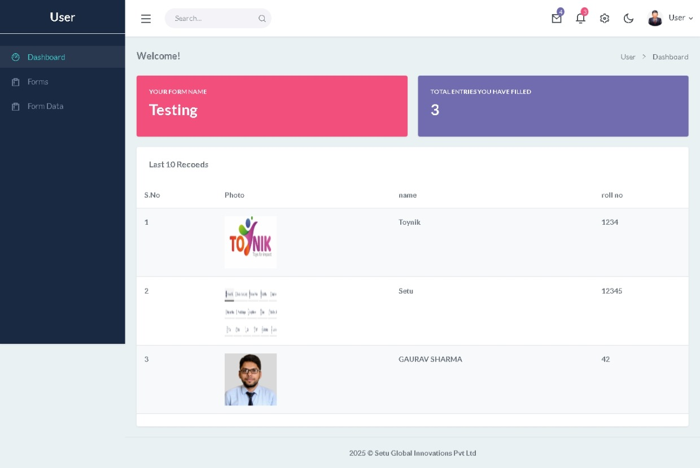

# ID Card Data Collector

**ID Card Data Collector** is a role-based PHP web application designed for collecting structured student data to support the ID card generation process. This system allows institutions like schools and colleges to manage data collection efficiently through a multi-panel interface: Super Admin, Admin, and User.

---

## 🔧 Features

### 🔹 Super Admin Panel
- Dashboard with statistics and nested tables for Admins, Forms, and Users
- Manage:
  - Admins (add/edit/delete)
  - Forms (based on Admin's institution)
  - Users (based on Forms)
- View active/inactive records

### 🔹 Admin Panel
- Dashboard with summary of Forms and Users
- Manage:
  - Forms (per institution)
  - Users (linked to forms)

### 🔹 User Panel
- Dashboard with form name, total entries, and recent submissions
- Fill student data using the assigned form
- View all submitted entries under “Form Data”

---

## 🧩 Use Cases

- Collect student data for ID card creation workflows
- Adaptable to any structured data collection process
- Designed for schools, colleges, and institutions with hierarchical roles

---

## 🛠️ Tech Stack

- PHP (Core PHP)
- MySQL
- HTML/CSS/JavaScript
- Bootstrap

---

## 📸 Screenshots

> Place your screenshots in a `/screenshots` folder and update the paths below.

### 🔹 Super Admin Dashboard

### 🔹 Admin Dashboard

### 🔹 User Dashboard

---

## 📞 Contact

- LinkedIn: [gaurav110601](https://www.linkedin.com/in/gaurav110601)

---
